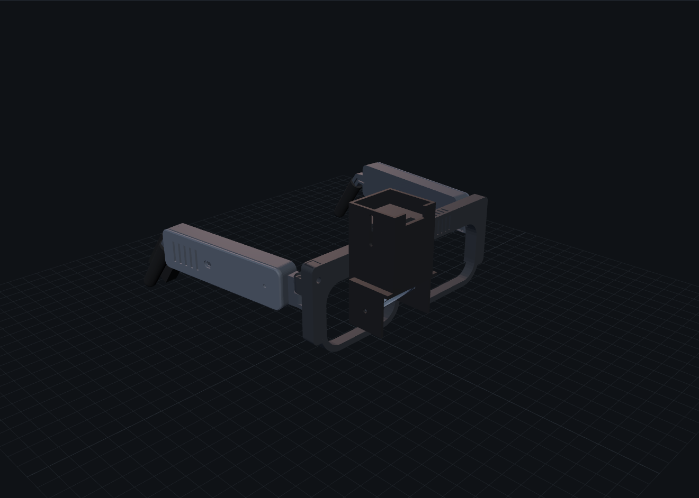
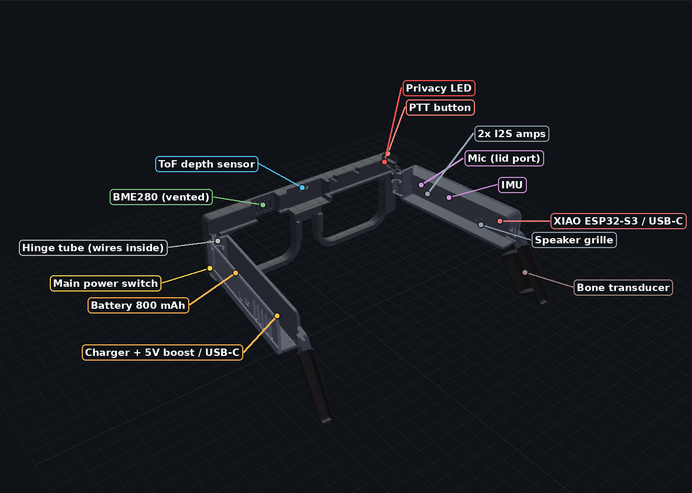
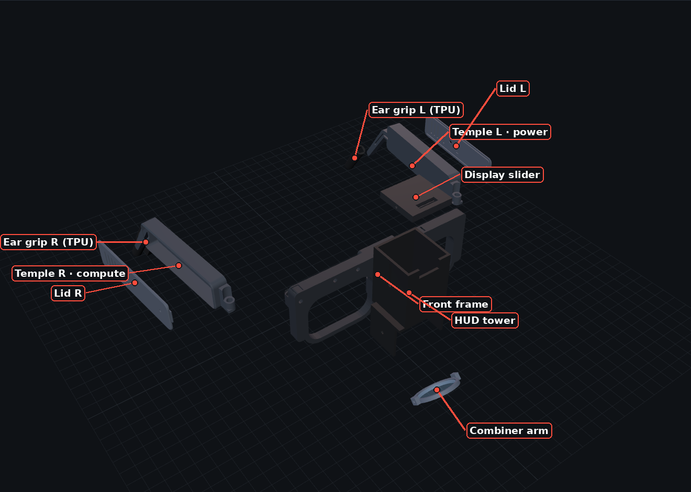
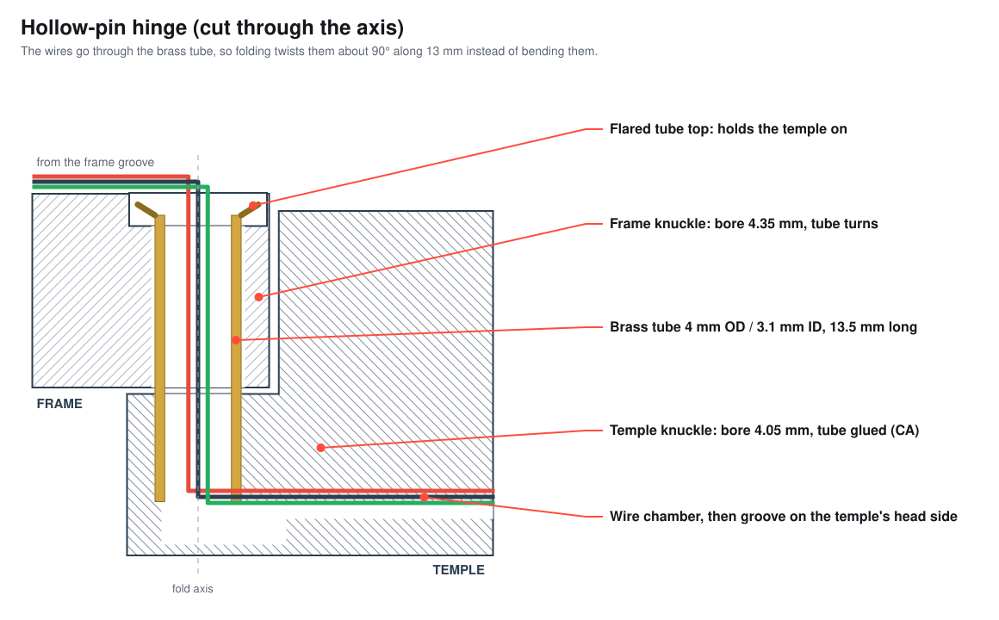
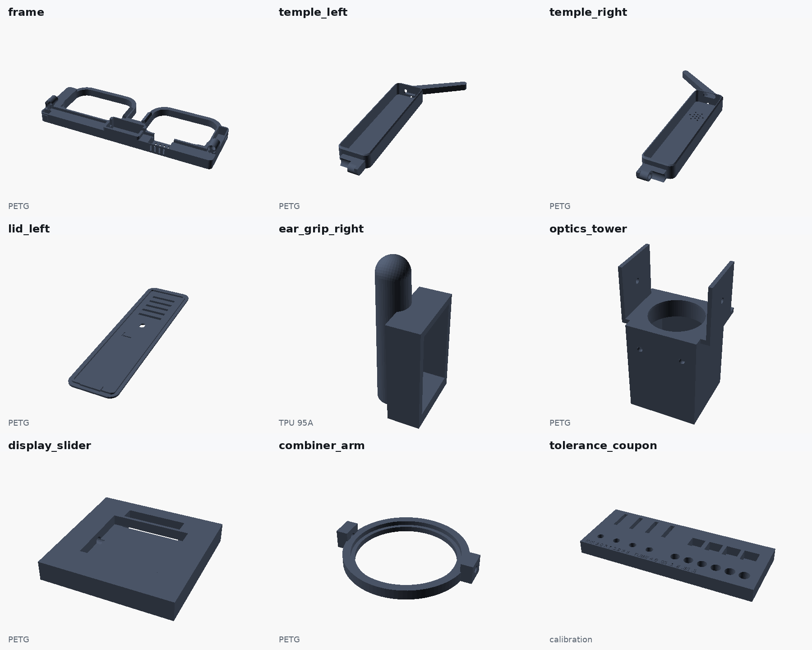

<div align="center">

# 👓 Adaptive Smart Glasses

**Open-source, camera-free, push-to-talk smart glasses you can print on a Bambu Lab P1S and wire from off-the-shelf modules.**

    



**[▶ Open the 3D web app](#-web-app)** · [3D files](cad/) · [BOM](docs/BOM.md) · [Pin-by-pin](docs/pinout.md) · [Build guide](docs/manufacturing.md) · [Requirements](docs/requirements.md)

</div>

---

## What makes it different

| 🔒 No camera | 🎙️ Mic is off in hardware | 🧠 Phone does the heavy AI | 🖨️ Simple to make |
|---|---|---|---|
| Depth comes only from an 8×8 Time-of-Flight (ToF) rangefinder | The mic gets power **only while you hold** the push-to-talk (PTT) button. A red LED shows it. | The ESP32-S3 handles sensors, audio and safety. Speech and AI run on the phone. | 10 printed parts, no supports, about $167 of core parts |

## Where everything goes



## How it goes together



## Build it in 6 steps

| Step | What | Time | Details |
|:-:|---|---|---|
| 1 | 🖨️ **Print** the coupon, tune, then plates 1–2 | ≈6 h | [`cad/plates/`](cad/plates) · [print settings](cad/print_manifest.csv) |
| 2 | 🔧 **Prep boards**: cut charger ISET, swap R16 for the NTC, tie mic SEL to GND | 30 min | [manufacturing §2](docs/manufacturing.md#2--prepare-the-boards) |
| 3 | 🧪 **Bench-wire and flash the factory test**. Everything must PASS before it goes into plastic. | 1 h | [pinout](docs/pinout.md) · [firmware](firmware/factory_test) |
| 4 | ✂️ **Cut the harness** and thread it through the brass hinge tubes | 1 h | [cut list](hardware/wire_cut_list.csv) |
| 5 | 🧩 **Assemble**: 2 lid screws, 2 hinge tubes, push-on grips | 1 h | [assembly](docs/README_CAD.md#assembly-order) |
| 6 | ✅ **Test + QA sheet** | 10 min | [QA checklist](docs/manufacturing.md#6--factory-test--qa-sheet-record-for-every-unit) |

## Wiring (every pin is in [`docs/pinout.md`](docs/pinout.md) and [`hardware/netlist.csv`](hardware/netlist.csv))


<details><summary><b>XIAO ESP32-S3 pin map</b></summary>

| Pin | Net | | Pin | Net |
|---|---|---|---|---|
| D0 | Battery sense (100k/100k) | | D6 | MEDIA_EN (LOW = media off) |
| D1 | PTT sense (via 1N4148) | | D7 | I²S in ← mic |
| D2 | Bone amp on/off | | D8 | I²S bit clock |
| D3 | Speaker amp on/off | | D9 | I²S word select |
| D4 / D5 | I²C SDA / SCL (Qwiic) | | D10 | I²S out → both amps |
| 5V | 5V_SW through 1N5817 | | 3V3 | sensors + PTT feed |
</details>

## The hinge: wires run through the pin



## Printed parts



| Plate | Parts | Material |
|---|---|---|
| [`plate_0`](cad/plates/plate_0_tolerance_coupon.3mf) | Tolerance coupon (print first) | PETG |
| [`plate_1`](cad/plates/plate_1_core_petg.3mf) | Frame, 2 temples, 2 lids | PETG |
| [`plate_2`](cad/plates/plate_2_tpu_grips.3mf) | 2 ear grips | TPU 95A |
| [`plate_3`](cad/plates/plate_3_hud_petg_EXPERIMENTAL.3mf) | HUD tower, display slider, combiner arm | black PETG · *experimental* |

Single parts are in [`cad/stl/`](cad/stl) and [`cad/3mf/`](cad/3mf). The source is [`cad/adaptive_smart_glasses.scad`](cad/adaptive_smart_glasses.scad) and every dimension is in [`cad/config.scad`](cad/config.scad).

## Bill of Materials (BOM)

| Tier | ≈ Cost | Main parts |
|---|---:|---|
| **Core** | **$167** | XIAO ESP32-S3 · VL53L5CX ToF · LSM6DSOX IMU · BME280 · SPH0645 mic · 2× MAX98357A · bone transducer · 15 mm speaker · Adafruit 6106 charger + 5 V boost · 800 mAh LiPo + NTC · tact switch, slide switch, LED, 2 diodes, 4 resistors · brass tube, M2 inserts |
| + HUD *(experimental)* | +$399 | 30R/70T combiner · Ø25 f25 asphere · 0.23″ 640×400 micro-OLED kit |
| + Media *(experimental)* | +$47 | Pi Zero 2 W · media battery · microSD |

Full list with links: [`docs/BOM.md`](docs/BOM.md) · [`bom.csv`](bom.csv)

## Status

| Part of the system | Status |
|---|---|
| Printed frame, temples, lids, grips | 🟢 **PROTOTYPE-READY**: watertight, no collisions, folds to about 90°, no supports |
| Electronics design + factory test | 🟢 **PROTOTYPE-READY**: firmware compiles, not yet run on a finished unit |
| Hollow-pin hinge harness | 🟡 **EXPERIMENTAL** until the 2,000-fold test passes |
| HUD optics · Media | 🟡 **EXPERIMENTAL** |
| Main firmware + phone app | ⚪ not started (requirements in [`docs/requirements.md`](docs/requirements.md)) |

> ⚠️ It weighs about 90 g with dev modules (normal glasses weigh 25–50 g), so the pods are chunky. A custom PCB (Phase 10) is the planned fix. Never test DRIVE_SAFE while you are driving.

## 🌐 Web app

GitHub Pages hosts an interactive 3D viewer with explode, part downloads, BOM and wiring. Click **Install app** to use it offline on desktop or phone.
To run it locally: `python3 -m http.server 8000`, then open http://localhost:8000.

## Edit and rebuild

```bash
sudo apt install -y openscad python3 zip
nano cad/config.scad                # change fit, tolerances, module sizes
./tools/build.sh                    # STL, 3MF, plates, viewer meshes, BOM.md, netlist, diagrams (~1 min)
./tools/package_release.sh v0.1.1   # fabrication zip for a GitHub release
```

## Licence

Hardware is **CERN-OHL-S-2.0**, software is **MIT**, docs are **CC BY-SA 4.0**. See [`LICENSES/`](LICENSES/README.md).
