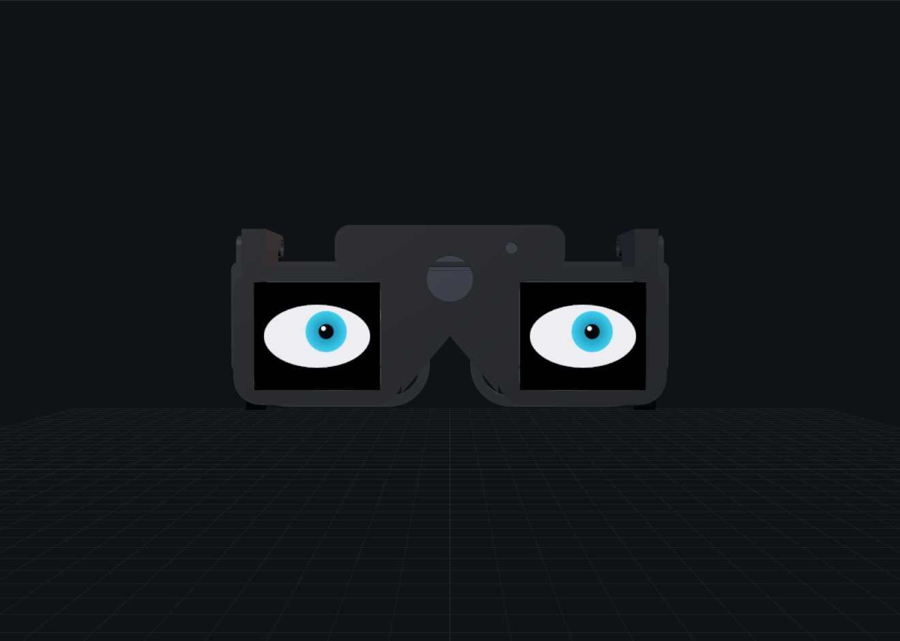
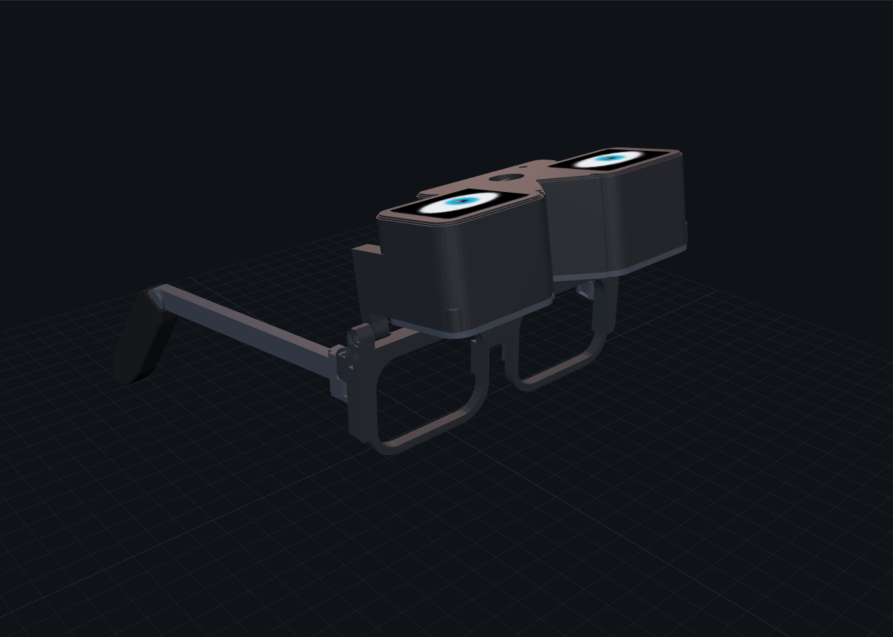

<div align="center">

# 👓 Adaptive Smart Glasses <sup>v0.2</sup>

**Open-source camera-passthrough glasses you can print on a Bambu Lab P1S: a center camera, outward "design" screens, and inner micro-OLED screens.**

    


**[▶ 3D web app + phone controls](#-web-app--phone-controls)** · [3D files](cad/) · [BOM](docs/BOM.md) · [Pin-by-pin](docs/pinout.md) · [Build guide](docs/manufacturing.md) · [Requirements](docs/requirements.md)

</div>

---

## The idea (Apple Vision Pro meets Google glasses, in a glasses-sized prototype)

| 🎨 Outside: design screens | 👁️ Inside: you see through the camera | 📷 Center camera | 🔋 Light on the face |
|---|---|---|---|
| Two 1.69″ screens on the front show eyes, patterns, rainbow or scrolling text. You pick them from your phone. | Two 0.71″ 1080p micro-OLEDs show the camera view with AR help: zoom, edge highlight, low-light boost, a horizon line and a heads-up display (HUD). | 12 MP, 102° wide, in the bridge. It has a **hardware** power switch and a red **CAMERA LIVE** light. | Heavy compute runs in a **pocket brick** (Raspberry Pi 5) or on the phone. Batteries sit in the **earpieces** as a counterweight. |

| Visor down: passthrough | Visor up: plain glasses |
|---|---|
|  |  |

The visor **flips up** on the brow hinge. That's the safety exit: with it up you see normally, and the inner screens switch off.

## Where everything goes


```
 phone (Web Bluetooth) ──BLE──►  XIAO ESP32-S3 (visor) ──SPI──► 2 outward design screens
                                   │ IMU, hall sensor, button, battery
                                   └──Wi-Fi UDP (head pose, AR mode)──┐
 camera (USB) ───────────────────────────────────────────────────────►├─► pocket brick (Pi 5)
 2 micro-OLEDs + HDMI board ◄────────── HDMI side-by-side 3840×1080 ──┘    passthrough + AR overlay
 earpiece cells (2 × 200 mAh) ──► XIAO  ·  brick power bank ──USB 5 V──► camera + display board
```

## Build it

| Step | What | Details |
|:-:|---|---|
| 1 | 🖨️ **Print** the coupon, tune, then plates 1–3 (7 parts, no supports) | [`cad/plates/`](cad/plates) · [print settings](cad/print_manifest.csv) |
| 2 | 🧪 **Bench test:** flash the XIAO and check the self-test and the designs on both screens | [`firmware/glasses_mcu`](firmware/glasses_mcu) |
| 3 | 🧠 **Brick:** run passthrough on a monitor first | [`brick/`](brick) |
| 4 | 🔭 **Optics** *(experimental)*: micro-OLED kit at side-by-side 3840×1080, then set focus and eye relief | [manufacturing §4](docs/manufacturing.md) |
| 5 | 🧩 **Assemble:** visor, 4 brass hinge tubes, earpiece cells, grips | [assembly](docs/README_CAD.md) |
| 6 | ✅ **Safety + QA:** unplug the camera and you should get a red screen in under 0.25 s; flip the visor up and the screens go dark | [QA sheet](docs/manufacturing.md) |


## Wiring (every pin: [`docs/pinout.md`](docs/pinout.md) · machine-readable: [`hardware/netlist.csv`](hardware/netlist.csv))

<details open><summary><b>Power + camera privacy</b></summary>


</details>
<details><summary><b>Signals: screens, camera, sensors</b></summary>


</details>

| XIAO pin | Net | | XIAO pin | Net |
|---|---|---|---|---|
| D0 / D1 | CS left / right screen | | D6 | screen backlight (PWM) |
| D2 | screen DC (shared) | | D7 | visor hall switch |
| D3 | battery sense ½ | | D8 / D10 | SPI clock / data (shared) |
| D4 / D5 | I²C → IMU | | D9 | action button |

## Printed parts (7 + coupon)


| Plate | Parts | Material |
|---|---|---|
| [`plate_0`](cad/plates/plate_0_tolerance_coupon.3mf) | Tolerance coupon (print first) | PETG |
| [`plate_1`](cad/plates/plate_1_frame_temples_petg.3mf) | Slim frame, 2 temples | PETG |
| [`plate_2`](cad/plates/plate_2_visor_petg.3mf) | Visor shell, visor back plate | black PETG |
| [`plate_3`](cad/plates/plate_3_tpu_grips.3mf) | 2 ear grips (they also close the battery bays) | TPU 95A |

## Bill of Materials (BOM)

| Group | ≈ Cost | Main parts |
|---|---:|---|
| **Glasses** | **$854** | 0.71″ 1080p micro-OLED dual kit with eyepieces ($660) · 2× Waveshare 1.69″ screens · Arducam 12 MP USB camera · XIAO ESP32-S3 · LSM6DSOX IMU · hall switch + magnet · 2× 200 mAh cells · 2 slide switches, button, LED · brass tubes, inserts, cable |
| **Pocket brick** | **$220** | Raspberry Pi 5 · 2-port power bank · microSD |
| **Phone** | $0 | Chrome + this repo's web app |

Full list with links: [`docs/BOM.md`](docs/BOM.md). A cheaper 0.49″ display route is listed as an option.

## Honest status

| Part | Status |
|---|---|
| Printed parts | 🟢 **PROTOTYPE-READY**: watertight, no collisions down or up, temples fold, no supports |
| Visor firmware (designs, BLE, IMU, Wi-Fi) | 🟢 compiles cleanly (ESP-IDF 5.5), not yet run on hardware |
| Brick passthrough | 🟡 **EXPERIMENTAL**: pipeline tested with synthetic frames. Expect 60–120 ms latency at 30 fps, mono (same image to both eyes) |
| Optics fit | 🟡 **EXPERIMENTAL**: eyepiece and driver-board sizes are `[MEASURE]` in [`cad/config.scad`](cad/config.scad) |
| Weight | ≈ 150 g (about 60 g printed + 90 g electronics). That's lighter than a headset but heavier than glasses (25–50 g). |

> ⚠️ **Passthrough safety:** with the visor down, you see only what the camera shows. Use it seated or walking slowly. **Never drive, cycle or use stairs with the visor down.** If the camera stalls, the brick shows a red **LIFT VISOR** screen. The camera can't be turned on in software, and the CAMERA LIVE light can't be hidden. Respect people around you.

## 🌐 Web app + phone controls

GitHub Pages hosts the 3D viewer (explode view, visor flip, live design preview, downloads, BOM, wiring) and a **Glasses** tab. In Chrome it uses Web Bluetooth to change the designs, text, brightness and AR mode on the real glasses. Click **Install app** to use it offline. Run it locally with `python3 -m http.server 8000`.

## Edit and rebuild

```bash
sudo apt install -y openscad python3 zip
nano cad/config.scad                 # IPD, head width, module sizes, tolerances
./tools/build.sh                     # STL, 3MF, plates, viewer meshes, BOM, netlist, diagrams
python3 tools/check_fit.py           # collision checks: visor down/up, temple fold
./tools/package_release.sh v0.2.1    # fabrication zip for a GitHub release
```

Licences: hardware **CERN-OHL-S-2.0**, software **MIT**, docs **CC BY-SA 4.0** ([`LICENSES/`](LICENSES/README.md)). The v0.1 camera-free design is in the git history and the v0.1.0 release.
