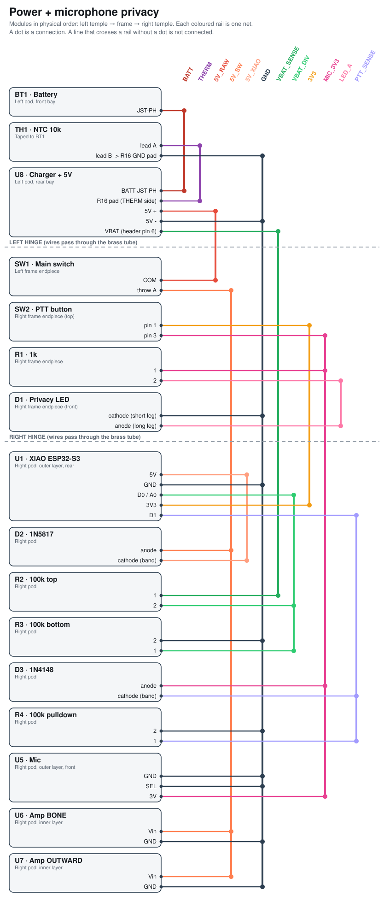
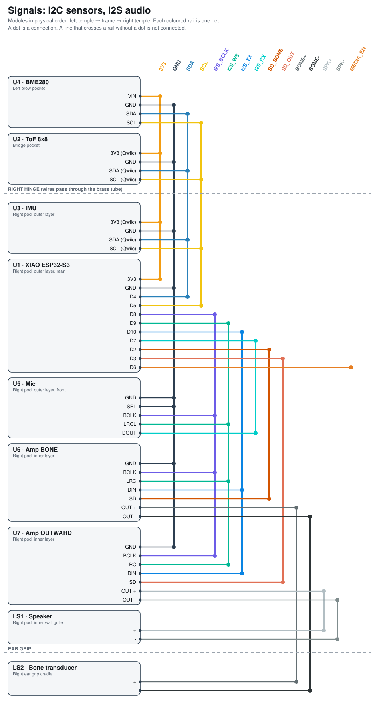

# Pin-by-pin connections

Generated by `tools/netlist.py` from the same table as `hardware/netlist.csv` and the diagrams. Edit the script, not this file.

## Board prep (do this before wiring)

| Ref | Pin / item | Action |
|---|---|---|
| U5 | RST | tie to 3V3 (the firmware sends a software reset) |
| U6 | RST | tie to 3V3 |
| U1 | D3 | ADC: VBAT/2 |
| U7 | 5V in | power the HDMI board from VBUS, never from the XIAO 3V3 |
| BT1 | before joining | charge both cells to 4.2 V separately, then wire them in parallel |

## Every module, every pin

### J1 · Brick cable
*micro-HDMI->HDMI + USB 4-core, braided* · Enters visor crest, left side

| Pin | Net | Connects to | Wire |
|---|---|---|---|
| USB VBUS | `VBUS_5V` | D2.anode, SW2.COM, U7.5V in | USB red |
| USB GND / HDMI shell | `GND` | BT1.-, BT2.-, U1.GND + BAT- pad, R3.2, D1.cathode, U2.GND, U3.GND, U4.GND, U5.GND, U6.GND, U7.GND, SW3.pin 2 | 28 AWG black |
| USB D+ | `USB_D+` | U2.D+ | USB green |
| USB D- | `USB_D-` | U2.D- | USB white |
| HDMI | `HDMI` | U7.HDMI in | HDMI cable |

### BT1 · Cell LEFT
*Protected 1S LiPo 501040 200 mAh* · Left earpiece

| Pin | Net | Connects to | Wire |
|---|---|---|---|
| + | `BAT+` | BT2.+, SW1.COM | 28 AWG red |
| - | `GND` | BT2.-, J1.USB GND / HDMI shell, U1.GND + BAT- pad, R3.2, D1.cathode, U2.GND, U3.GND, U4.GND, U5.GND, U6.GND, U7.GND, SW3.pin 2 | 28 AWG black |

### BT2 · Cell RIGHT
*Protected 1S LiPo 501040 200 mAh* · Right earpiece

| Pin | Net | Connects to | Wire |
|---|---|---|---|
| + | `BAT+` | BT1.+, SW1.COM | 28 AWG red |
| - | `GND` | BT1.-, J1.USB GND / HDMI shell, U1.GND + BAT- pad, R3.2, D1.cathode, U2.GND, U3.GND, U4.GND, U5.GND, U6.GND, U7.GND, SW3.pin 2 | 28 AWG black |

### SW1 · Main power
*Wurth 452403012014 DPDT slide* · Visor crest top

| Pin | Net | Connects to | Wire |
|---|---|---|---|
| COM | `BAT+` | BT1.+, BT2.+ | 28 AWG red |
| throw A | `BAT_SW` | U1.BAT+ pad, R2.1 | local |

### SW2 · Camera kill
*Wurth 452403012014 DPDT slide* · Visor crest top

| Pin | Net | Connects to | Wire |
|---|---|---|---|
| COM | `VBUS_5V` | J1.USB VBUS, D2.anode, U7.5V in | USB red |
| throw A | `CAM_5V` | U2.5V (USB VBUS), R1.1 | local |

### D1 · CAMERA LIVE LED
*3 mm red LED* · Visor front, beside camera

| Pin | Net | Connects to | Wire |
|---|---|---|---|
| anode (long leg) | `LED_A` | R1.2 | local |
| cathode | `GND` | BT1.-, BT2.-, J1.USB GND / HDMI shell, U1.GND + BAT- pad, R3.2, U2.GND, U3.GND, U4.GND, U5.GND, U6.GND, U7.GND, SW3.pin 2 | 28 AWG black |

### R1 · 1k
*1k 1/8 W* · Visor crest

| Pin | Net | Connects to | Wire |
|---|---|---|---|
| 1 | `CAM_5V` | SW2.throw A, U2.5V (USB VBUS) | local |
| 2 | `LED_A` | D1.anode (long leg) | local |

### D2 · 1N5817
*1N5817 Schottky* · Visor crest

| Pin | Net | Connects to | Wire |
|---|---|---|---|
| anode | `VBUS_5V` | J1.USB VBUS, SW2.COM, U7.5V in | USB red |
| cathode (band) | `XIAO_5V` | U1.5V | local |

### U1 · XIAO ESP32-S3
*Seeed XIAO ESP32-S3 (non-Sense)* · Visor bridge, behind camera

| Pin | Net | Connects to | Wire |
|---|---|---|---|
| BAT+ pad | `BAT_SW` | SW1.throw A, R2.1 | local |
| D3 (A2) | `VBAT_DIV` | R2.2, R3.1 | local |
| 5V | `XIAO_5V` | D2.cathode (band) | local |
| GND + BAT- pad | `GND` | BT1.-, BT2.-, J1.USB GND / HDMI shell, R3.2, D1.cathode, U2.GND, U3.GND, U4.GND, U5.GND, U6.GND, U7.GND, SW3.pin 2 | 28 AWG black |
| 3V3 | `3V3` | U3.VIN (Qwiic), U4.VCC, U5.VCC + RST, U6.VCC + RST | local |
| D8 | `SPI_SCK` | U5.CLK, U6.CLK | local |
| D10 | `SPI_MOSI` | U5.DIN, U6.DIN | local |
| D2 | `LCD_DC` | U5.DC, U6.DC | local |
| D0 | `CS_L` | U5.CS | local |
| D1 | `CS_R` | U6.CS | local |
| D6 | `LCD_BL` | U5.BL, U6.BL | local |
| D4 | `SDA` | U3.SDA (Qwiic) | Qwiic blue |
| D5 | `SCL` | U3.SCL (Qwiic) | Qwiic yellow |
| D7 | `HALL` | U4.OUT | local |
| D9 | `BUTTON` | SW3.pin 1 | local |

### R2 · 100k top
*100k 1/8 W* · Visor bridge

| Pin | Net | Connects to | Wire |
|---|---|---|---|
| 1 | `BAT_SW` | SW1.throw A, U1.BAT+ pad | local |
| 2 | `VBAT_DIV` | R3.1, U1.D3 (A2) | local |

### R3 · 100k bottom
*100k 1/8 W* · Visor bridge

| Pin | Net | Connects to | Wire |
|---|---|---|---|
| 1 | `VBAT_DIV` | R2.2, U1.D3 (A2) | local |
| 2 | `GND` | BT1.-, BT2.-, J1.USB GND / HDMI shell, U1.GND + BAT- pad, D1.cathode, U2.GND, U3.GND, U4.GND, U5.GND, U6.GND, U7.GND, SW3.pin 2 | 28 AWG black |

### U2 · Camera
*Arducam IMX708 UVC 102 deg* · Visor centre bridge, front

| Pin | Net | Connects to | Wire |
|---|---|---|---|
| 5V (USB VBUS) | `CAM_5V` | SW2.throw A, R1.1 | local |
| GND | `GND` | BT1.-, BT2.-, J1.USB GND / HDMI shell, U1.GND + BAT- pad, R3.2, D1.cathode, U3.GND, U4.GND, U5.GND, U6.GND, U7.GND, SW3.pin 2 | 28 AWG black |
| D+ | `USB_D+` | J1.USB D+ | USB green |
| D- | `USB_D-` | J1.USB D- | USB white |

### U3 · IMU
*Adafruit 4438 LSM6DSOX* · Visor bridge

| Pin | Net | Connects to | Wire |
|---|---|---|---|
| GND | `GND` | BT1.-, BT2.-, J1.USB GND / HDMI shell, U1.GND + BAT- pad, R3.2, D1.cathode, U2.GND, U4.GND, U5.GND, U6.GND, U7.GND, SW3.pin 2 | 28 AWG black |
| VIN (Qwiic) | `3V3` | U1.3V3, U4.VCC, U5.VCC + RST, U6.VCC + RST | local |
| SDA (Qwiic) | `SDA` | U1.D4 | Qwiic blue |
| SCL (Qwiic) | `SCL` | U1.D5 | Qwiic yellow |

### U4 · Hall switch
*TI DRV5032FA on SOT-23 adapter* · Back of visor bridge, faces brow magnet

| Pin | Net | Connects to | Wire |
|---|---|---|---|
| GND | `GND` | BT1.-, BT2.-, J1.USB GND / HDMI shell, U1.GND + BAT- pad, R3.2, D1.cathode, U2.GND, U3.GND, U5.GND, U6.GND, U7.GND, SW3.pin 2 | 28 AWG black |
| VCC | `3V3` | U1.3V3, U3.VIN (Qwiic), U5.VCC + RST, U6.VCC + RST | local |
| OUT | `HALL` | U1.D7 | local |

### U5 · LCD LEFT
*Waveshare 1.69in 240x280 ST7789V2* · Left pod, front

| Pin | Net | Connects to | Wire |
|---|---|---|---|
| GND | `GND` | BT1.-, BT2.-, J1.USB GND / HDMI shell, U1.GND + BAT- pad, R3.2, D1.cathode, U2.GND, U3.GND, U4.GND, U6.GND, U7.GND, SW3.pin 2 | 28 AWG black |
| VCC + RST | `3V3` | U1.3V3, U3.VIN (Qwiic), U4.VCC, U6.VCC + RST | local |
| CLK | `SPI_SCK` | U1.D8, U6.CLK | local |
| DIN | `SPI_MOSI` | U1.D10, U6.DIN | local |
| DC | `LCD_DC` | U1.D2, U6.DC | local |
| CS | `CS_L` | U1.D0 | local |
| BL | `LCD_BL` | U1.D6, U6.BL | local |

### U6 · LCD RIGHT
*Waveshare 1.69in 240x280 ST7789V2* · Right pod, front

| Pin | Net | Connects to | Wire |
|---|---|---|---|
| GND | `GND` | BT1.-, BT2.-, J1.USB GND / HDMI shell, U1.GND + BAT- pad, R3.2, D1.cathode, U2.GND, U3.GND, U4.GND, U5.GND, U7.GND, SW3.pin 2 | 28 AWG black |
| VCC + RST | `3V3` | U1.3V3, U3.VIN (Qwiic), U4.VCC, U5.VCC + RST | local |
| CLK | `SPI_SCK` | U1.D8, U5.CLK | local |
| DIN | `SPI_MOSI` | U1.D10, U5.DIN | local |
| DC | `LCD_DC` | U1.D2, U5.DC | local |
| CS | `CS_R` | U1.D1 | local |
| BL | `LCD_BL` | U1.D6, U5.BL | local |

### U7 · Micro-OLED board
*Dual 0.71in micro-OLED HDMI driver* · Visor crest bay

| Pin | Net | Connects to | Wire |
|---|---|---|---|
| 5V in | `VBUS_5V` | J1.USB VBUS, D2.anode, SW2.COM | USB red |
| GND | `GND` | BT1.-, BT2.-, J1.USB GND / HDMI shell, U1.GND + BAT- pad, R3.2, D1.cathode, U2.GND, U3.GND, U4.GND, U5.GND, U6.GND, SW3.pin 2 | 28 AWG black |
| HDMI in | `HDMI` | J1.HDMI | HDMI cable |
| FPC L / FPC R | `OLED_FPC` | test pad / no connection | panel flex |

### SW3 · Action button
*Omron B3F-1000 6x6 tact* · Visor crest top flexure

| Pin | Net | Connects to | Wire |
|---|---|---|---|
| pin 2 | `GND` | BT1.-, BT2.-, J1.USB GND / HDMI shell, U1.GND + BAT- pad, R3.2, D1.cathode, U2.GND, U3.GND, U4.GND, U5.GND, U6.GND, U7.GND | 28 AWG black |
| pin 1 | `BUTTON` | U1.D9 | local |

## Harness cut list (wires that cross a hinge)

| Signal | Wire | Cut (mm) | Route |
|---|---|---:|---|
| BAT+ / GND (left cell) | 30 AWG red/black | 230 | BT1 -> earpiece groove -> L temple tube -> frame -> L visor tube -> SW1 |
| BAT+ / GND (right cell) | 30 AWG red/black | 330 | BT2 -> R temple tube -> brow groove -> L visor tube -> SW1 |
| Brick cable | HDMI + USB 4-core | 1500 | Pocket brick -> clip along left temple -> visor crest (left side) |
| LCD harness | 8 x 30 AWG | 120 | U1 (bridge) -> U5 and U6 (shared SCK/MOSI/DC/BL/VCC/GND, own CS) |

Only battery wires cross hinges: each temple tube carries its cell's BAT+ and GND (2 wires), and the left visor tube carries both pairs (4 wires). Everything else lives inside the visor.
